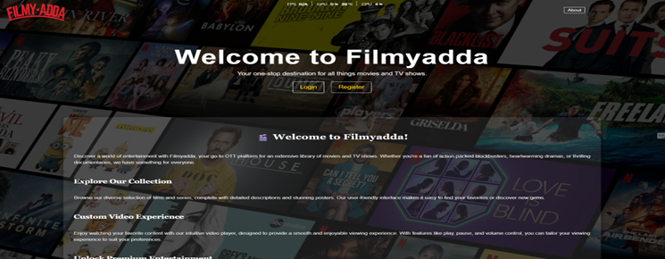
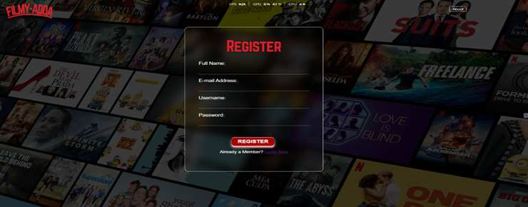
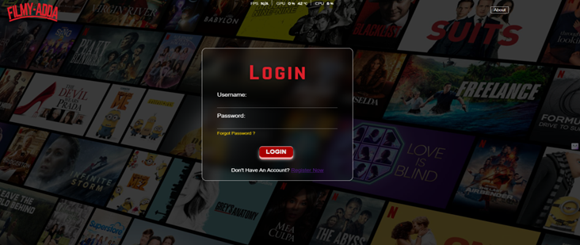
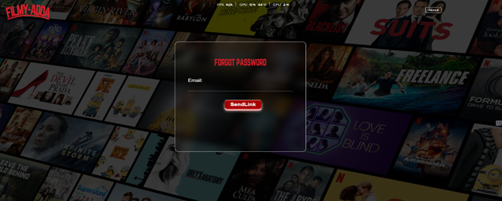
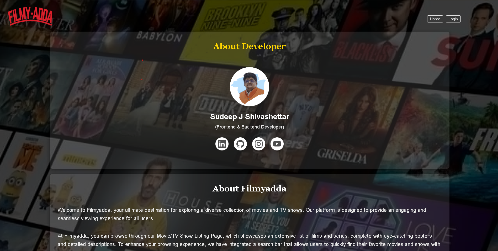
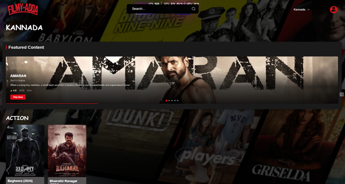
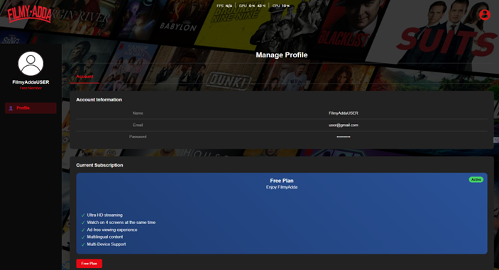
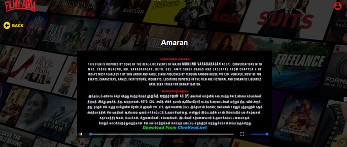
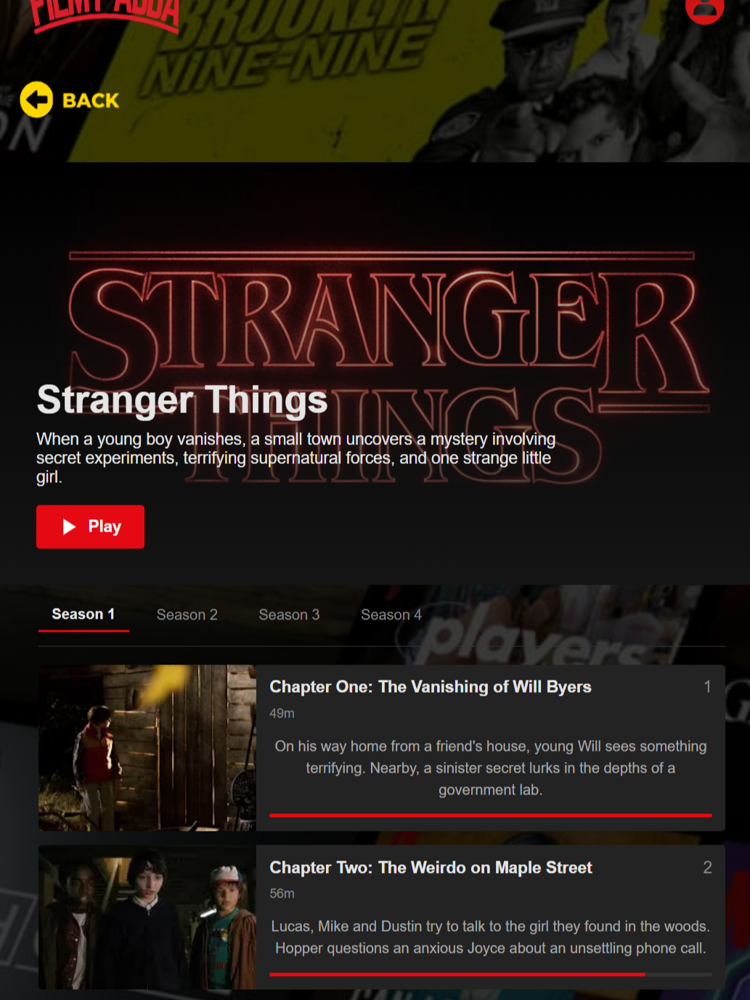
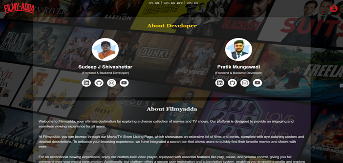

# 🎬 FilmyAdda 2.0 Serverless

<div align="center">
<p></p>

[](https://app.netlify.com/sites/filmyadda-srverless/deploys)
[](https://filmyadda-srverless.netlify.app/)
[](https://github.com/ShettyBro/Fillmyadda-2.0-serverless/stargazers)
[](LICENSE)
[](https://github.com/ShettyBro)

*A Netflix-inspired serverless movie streaming platform delivering premium OTT experience* 🍿

</div>

## 🌟 About FilmyAdda 2.0

FilmyAdda 2.0 is a cutting-edge serverless movie streaming platform that brings the magic of cinema to your fingertips. Built with modern web technologies and cloud-native architecture for a seamless entertainment experience.

## ✨ Features

- **🔐 Secure Authentication** - Email registration, login, and password recovery
- **🎥 HD Movie Streaming** - High-quality video playback with custom player
- **🔍 Smart Search** - Find movies quickly and easily
- **📱 Responsive Design** - Works perfectly on all devices
- **⚡ Fast Performance** - Serverless architecture for instant loading

## 🛠️ Tech Stack

<div align="center">

### Frontend Technologies


### Backend Technologies


### Database & Cloud


</div>

## 📁 Project Structure

```
filmyadda/
├── functions/           # Serverless API functions
│   ├── login.js
│   ├── register.js
│   ├── getVideoDetails.js
│   └── ...
├── public/             # Frontend files
│   ├── css/
│   ├── js/
│   └── index.html
└── package.json
```

## 🚀 Quick Start

1. **Clone the repository**
   ```bash
   git clone https://github.com/ShettyBro/Fillmyadda-2.0-serverless.git
   cd Fillmyadda-2.0-serverless
   ```

2. **Install dependencies**
   ```bash
   npm install
   ```

3. **Set up environment variables**
   ```bash
   # Create .env file with your database and API keys
   DB_CONNECTION_STRING=your_azure_sql_connection
   JWT_SECRET=your_jwt_secret
   ```

4. **Deploy to Netlify**
   - Connect your GitHub repo to Netlify
   - Set build directory to `public/`
   - Add environment variables in Netlify dashboard

## 🤝 Contributing

1. Fork the repository
2. Create a feature branch: `git checkout -b feature/new-feature`
3. Commit changes: `git commit -m 'Add new feature'`
4. Push to branch: `git push origin feature/new-feature`
5. Submit a pull request

<br>
<h2  align="center">Screenshots</h2>
<div align="center">

<br>
<h3 align="left"> Index/Home Page <h3></h3>



<h3 align="left"> Register Page <h3></h3>



<br>
<h3 align="left"> Login Page <h3></h3>


<br>

<br>
<h3 align="left"> Forgot Password Page <h3></h3>



<br>
<h3 align="left"> Language Selection Page <h3></h3>


<br>
<h3 align="left"> Content Page <h3></h3>


<br>
<h3 align="left"> Profile Page <h3></h3>


<br>
<h3 align="left"> Movie Player <h3></h3>



<br>
<h3 align="left"> Web-Series <h3></h3>



<br>
<h3 align="left"> About Developers <h3></h3>



<br>
---

<div align="center">

**⭐ Star this repository if you found it helpful!**

**🚀 [Try FilmyAdda 2.0 Live](https://filmyadda.sudeepbro.me/index.html)**

*Made with ❤️ for movie lovers worldwide*

</div>
